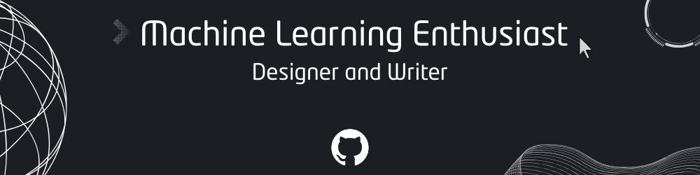

# About me

  
 

hello there fellow reader.. allow me to introduce myself
- I'm Naveen Garg, a resilent coder.
- Apart from bashing my head while debugging, I also write about a variety of things.
- If you aren't aware yet, I am super interested in making machines behave like humans (but better).
- I am always up for chat about how cats are ruling over the world and have branches spread out to universe.

 
 

# Read my stuff

Apart from blogs I also write novel.. that I'll add once it gets published. 

# Reach out to me

# Now let's talk CODING !!

<a href="https://github.com/yoshi389111/github-profile-3d-contrib">
<picture>
  <source media="(prefers-color-scheme: dark)" srcset="https://raw.githubusercontent.com/CodeNaveen-in/CodeNaveen-in/main/profile-3d-contrib/profile-night-view.svg">
  
</picture>
</a>

# Technologies I know
Let's talk about the technologies I tend to keep using generally in my projects. I make projects in : 
- Web Development
- Machine Learning

But you'll find some repos in other things as well.

## 🚀 Tech Stack

| Category       | Technologies |
|----------------|--------------|
| **Languages**  |  |
| **Frameworks** |  |
| **Databases**  |  |
| **Dev Tools**  |  |
| **Design & OS**|  |
| **AI Tools**   |  |
---

